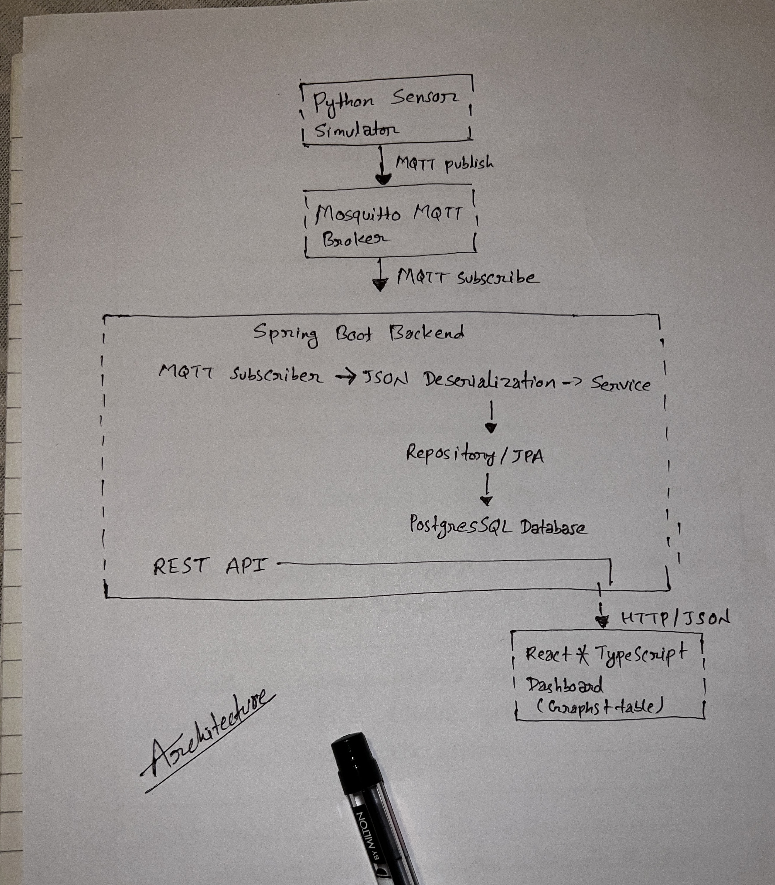

# PulseGrid-IOT

PulseGrid is a full-stack IoT sensor monitoring application. A Python sensor simulator publishes readings through MQTT, a Java Spring Boot backend processes and stores the data in PostgreSQL, and a React dashboard displays sensor readings and alerts.

## Architecture




## Tech Stack

- **Backend:** Java 19, Spring Boot, Spring Data JPA, Hibernate
- **Messaging:** MQTT and Eclipse Mosquitto
- **Database:** PostgreSQL 17
- **Frontend:** React, TypeScript, Vite, Recharts, Axios
- **Testing:** JUnit and Spring Boot integration tests
- **Development tools:** Docker and Maven

## Features

- Python-based IoT sensor simulator
- MQTT publish/subscribe communication
- JSON sensor-reading deserialization
- Persistent storage using PostgreSQL
- Spring Data JPA repository layer
- REST API for sensor readings
- Temperature and humidity threshold alerts
- React dashboard for monitoring readings
- Charts and tables for sensor data visualization
- Integration testing for backend services

## Project Structure

```text
Pulsegrid-IOT/
├── backend/
│   ├── .mvn/
│   ├── src/
│   ├── pom.xml
│   ├── mvnw
│   └── mvnw.cmd
├── frontend/
│   ├── public/
│   ├── src/
│   ├── package.json
│   ├── package-lock.json
│   ├── tsconfig.json
│   └── vite.config.ts
├── mosquitto/
│   └── mosquitto.conf
├── simulator/
│   └── sensor_simulator.py
├── .gitignore
└── README.md
```

## Prerequisites

Install the following before running the project:

- Java 19 or later
- Docker
- Python 3 or later
- Node.js and npm

## Getting Started

### 1. Clone the repository

```bash
git clone git@github.com:rubeshnpl13/Pulsegrid-IOT.git
cd Pulsegrid-IOT
```

Replace `YOUR_GITHUB_USERNAME` with your GitHub username.

### 2. Start PostgreSQL

Run PostgreSQL in a Docker container:

```bash
docker run --name pulsegrid-db \
  -e POSTGRES_DB=pulsegrid \
  -e POSTGRES_USER=pulsegrid \
  -e POSTGRES_PASSWORD=secret \
  -p 5432:5432 \
  -d postgres:17
```

Check that the container is running:

```bash
docker ps
```

### 3. Start the MQTT broker

Start the Mosquitto broker using the project configuration:

```bash
docker run -it --name pulsegrid-broker \
  -p 1883:1883 \
  -v "$(pwd)/mosquitto/mosquitto.conf:/mosquitto/config/mosquitto.conf" \
  eclipse-mosquitto
```

If you are using Windows PowerShell, use the appropriate absolute path for `mosquitto.conf`.

### 4. Start the backend

Open a new terminal and run:

```bash
cd backend
./mvnw spring-boot:run
```

On Windows, use:

```bash
mvnw.cmd spring-boot:run
```

The backend connects to PostgreSQL and subscribes to the configured MQTT topic.

### 5. Start the sensor simulator

Open another terminal:

```bash
cd simulator
python -m venv .venv
source .venv/bin/activate
pip install paho-mqtt
python sensor_simulator.py
```

On Windows PowerShell, activate the virtual environment with:

```powershell
.venv\Scripts\Activate.ps1
```

The simulator publishes sensor readings to the MQTT broker.

### 6. Start the frontend

Open another terminal:

```bash
cd frontend
npm install
npm run dev
```

Open the local URL printed by Vite in your browser.

## MQTT Message Format

The simulator publishes JSON messages similar to the following:

```json
{
  "sensorId": "sensor-001",
  "type": "temperature",
  "value": 23.5,
  "unit": "°C",
  "timestamp": "2026-08-16T02:30:00Z"
}
```

The Spring Boot MQTT subscriber receives the message, converts it into a sensor-reading object, and passes it to the service layer for persistence.

## Backend Design

The backend follows a layered Spring Boot architecture:

```text
MQTT Subscriber
      |
      v
JSON Deserialization
      |
      v
SensorReading Entity
      |
      v
SensorReadingService
      |
      v
SensorReadingRepository
      |
      v
PostgreSQL
```

The REST API uses the same service and repository layers to retrieve stored data:

```text
React Dashboard
      |
      | HTTP / JSON
      v
REST Controller
      |
      v
Service Layer
      |
      v
Repository Layer
      |
      v
PostgreSQL
```

Alerts are generated when sensor values exceed configured limits. The alert functionality includes an `AlertService`, `AlertEventRepository`, and `AlertController`.

## API Overview

The following endpoints describe the main API functionality. Update the paths if your controller mappings use different routes.

| Method | Endpoint | Description |
|---|---|---|
| `GET` | `/api/readings` | Retrieve sensor readings |
| `GET` | `/api/readings/{id}` | Retrieve a reading by ID |
| `GET` | `/api/readings/sensor/{sensorId}` | Retrieve readings for a sensor |
| `GET` | `/api/alerts` | Retrieve generated alerts |
| `DELETE` | `/api/readings/{id}` | Delete a sensor reading |

## Configuration

The backend requires connection details for PostgreSQL and MQTT. These values are normally configured in `backend/src/main/resources/application.properties`.

Typical local-development values are:

```properties
spring.datasource.url=jdbc:postgresql://localhost:5432/pulsegrid
spring.datasource.username=pulsegrid
spring.datasource.password=secret

mqtt.broker-url=tcp://localhost:1883
mqtt.topic=pulsegrid/sensors
```

Use the property names already defined in your project if they differ from these examples.

## Stopping the Services

Stop the running Docker containers with:

```bash
docker stop pulsegrid-db pulsegrid-broker
```

To remove the containers:

```bash
docker rm pulsegrid-db pulsegrid-broker
```

## Roadmap

- Add Docker Compose for the complete application stack
- Add authentication and authorization
- Improve real-time dashboard updates using WebSockets or Server-Sent Events
- Add more sensor types
- Add configurable alert thresholds
- Add notification support for critical alerts
- Deploy the application to the cloud
